[](https://socprime.com/)
# The Prime Hunt Browser Extension
The Prime Hunt is an open-source browser extension for threat hunting developed by SOC Prime. It introduces a One UI idea to simplify and speed up the investigation process regardless of the SIEMs or EDR in use. This is useful both for threat hunters starting off their careers and for seasoned professionals. The former can master the different security platforms and query languages faster, learning the right methodology from the very beginning, while the latter benefit from a streamlined workflow.

One UI for different technologies mirrors the concept of Sigma as a single language for cybersecurity. Sigma rules can be translated into multiple platform formats. This extension helps any threat hunter easily run and tune Sigma rule translations in those platforms, ensuring the community is Sigma-enabled. Meanwhile, sharing query hits (coming soon) helps the entire community measure and consolidate the MITRE ATT&CK® technique prevalence and rule quality.

With The Prime Hunt, you can easily see what accounts and assets are affected by the suspicious activity your query detects. Filter for or filter out query results by any field values with one click or look for all events related to them. Easily drill down to any CTI or any other sources that can help you in the investigation.


If you have any questions, would like to give feedback, or need help, contact us at support@socprime.com.

## Requirements
Supported browsers: Chrome, Firefox, Edge.  
Supported security platforms: Microsoft Sentinel, Microsoft Defender for Endpoint, Splunk, IBM QRadar, Elastic (Kibana), ArcSight, Amazon Athena, Amazon OpenSearch, Falcon LogScale, Chronicle Security.
All default data schemas are supported including OCSF, CEF, ECS, LEEF, CIM, OSSEM.

## Installation
Follow the instructions below. After the installation, reload the page.

### Chrome
Install the extension from the [Chrome Web Store](https://chrome.google.com/webstore/detail/the-prime-hunt/jgelecjbbjlmghiejapgafechokhpmcc).

Alternatively, you can download the extension pack from GitHub and install it manually:

1. Open the three-dots menu and select **More Tools** > **Extensions**.


2. Make sure the **Developer mode** is **On**.


3. Click **Load unpacked** and select the **/dist/production/chrome** extension folder from your file system.


Please note that the extension might not work if a self-signed certificate is used in your SIEM instance.

### Firefox
Download the extension pack from GitHub and install it manually:

1. Open the three-bars menu and select **Add-ons and Themes**.


2. Make sure the **Extensions** tab is selected on the left-side panel.


3. Click the gear icon on the right and select **Debug Add-ons**.


4. Click **Load Temporary Add-on…** button and select the **/dist/production/firefox/manifest.json** file from your file system.


### Edge
Install the extension from the [Edge Add-ons](https://microsoftedge.microsoft.com/addons/detail/the-prime-hunt/lphlpfloalbpofhppgkfggebccinmigb).

Alternatively, you can download the extension pack from GitHub and install it manually:

1. Open the three-dots menu and select **Extensions**.


2. Make sure the **Developer mode** is **On**.


3. Click **Load unpacked** and select the **/dist/production/edge** extension folder from your file system.


## Compilation
You can install a compiled version of the extension for your browser from the `dist` folder or compile it yourself from the source files. To compile the extension:
1. Install Yarn from here: [https://classic.yarnpkg.com/lang/en/docs/install](https://classic.yarnpkg.com/lang/en/docs/install)
2. Run console commands in your source root folder:
```sh
yarn install
yarn extension --mode=development|production
```

## How to Use
1. Go to your SIEM/EDR/XDR environment and start the extension from the Extensions panel next to the address bar. You can resize the extension window both horizontally and vertically by dragging its edges. To move the window, hover over the extension's name or the window's edge and drag it.

**Note:**  
The position and size of the extension's window are stored as the `the-prime-hunt--extension--position` key in the local storage of your browser (developer tools > Application > Local Storage > your security platform). If you delete the value of the key (right-click > Delete), the default position and size are used.

2. Run a query in your SIEM/EDR/XDR environment. If there are results, the extension lists the accounts and assets affected by the suspicious activity. If there are fields without values, you can show/hide them by clicking **Show empty/Hide empty**.
3. In the extension, click the down arrow next to a field name to show the results in that field.
4. Hover over a result:


- Click the copy icon to copy the result to the clipboard
- Click the plus icon to include the account/asset in the search
- Click the minus icon to exclude the account/asset from the search
- Click the eye-and-list icon to search for all events that involve the account/asset
- Click the plane icon to do the following:
   - Send the result to OpenCTI as an IOC (see **Setting up OpenCTI Integration**)
   - Send the result as an IOC via email using a pre-set template or a custom template (see **Setting up Mail Templates**)

To add a field, click the plus icon next to the Fields label, enter the field name exactly as it appears in your SIEM/EDR/XDR using the relevant suggester option, and click on the checkmark icon. To remove a field from the extension, click on the remove icon next to the field. **Note**: field names for the suggester are stored as the `the-prime-hunt--extension--fields` key in the browser's local storage.


To add a custom tab, click the plus icon on the right of the existing tabs, enter an arbitrary title, and click the checkmark. Double-click the created custom tab title to rename or delete the tab.


**Note:**  
The fields that have been added manually are stored as the `the-prime-hunt--extension--watchers` key in the local storage of your browser (developer tools > Application > Local Storage > your security platform). If you delete the value of the key (right-click > Delete), only the default fields are used again.

In Amazon Athena, if the extension detects that your query includes a select statement that limits the fields in the results, you can remove the statement to see the all results. To do it, click **Yes** when you see a corresponding prompt in the extension.

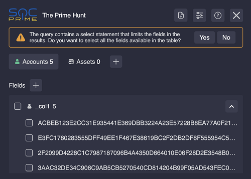

5. You can also select multiple results by setting the checkboxes next to them. In this case, bulk action buttons appear at the extension’s footer:
- Click the **Copy** button to copy the selected accounts/assets to the clipboard
- Click the **Include** button to include the selected accounts/assets in the search
- Click the **Exclude** button to exclude the selected accounts/assets from the search
- Click the **Show All Events** button to search for all events that involve the selected accounts/assets
- Click the **Send to** button to send the selected results as IOCs via email using a pre-set template or a custom template (see **Setting up Mail Templates**)
- Click the **Search At** button and select a CTI source to analyze the selected accounts/assets. Default options include: VirusTotal, VirusTotal Enterprise, Anomali, EchoTrail, Ultimate Windows Security, AbuseIPDB, URLhaus (by Abuse.ch), MalwareBazaar MD5 (by Abuse.ch), MalwareBazaar SHA256 (by Abuse.ch), ThreatFox IOCs (by Abuse.ch), FeodoTracker C&C (by Abuse.ch), Shodan


- You can customize or remove any menu item, add your OpenCTI credentials, or add a new integration in Search Settings


- Optionally, export the selected results as a CSV


6. If you need to reset the extension, go to the Extensions page in your browser's settings and click **Reload** (or the related icon). Reloading does not affect the custom settings of position and size of the extension, integrations, and watching fields (to reset them you should clear specific keys in your browser’s local storage.)

## Integration Settings
To open integration settings, click the corresponding icon at the top of the extension.

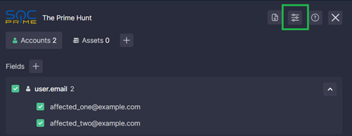

**Note:** When using integrations with third-party services, do not send to them any sensitive information.

### Integrations
Click the right arrow next to an integration name to configure it.

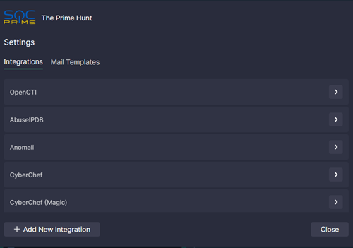

Custom integration names and URLs are stored as the `the-prime-hunt--extension--integrations` key in the local storage of your browser (developer tools > Application > Local Storage > your security platform). If you delete the value of the key (right-click > Delete) or click **Restore Defaults** in the integration configuration in the extension's UI, the default names and URLs are used.


By default, when you select an option in the **Search At** dropdown menu, an analysis of each selected result is opened in a new tab. The only exception is VirusTotal Enterprise where a single new tab is opened for all results. By default, the browser blocks opening multiple tabs, so please allow pop-ups when prompted to do so.


Here is the list of markers you can use in the integration URL:
- `$VALUE$`: is replaced by the selected value (in case of a bulk action, each result is opened in a separate new tab)
- `$VALUES$`: is replaced by the selected values separated by a comma (in case of a bulk action, all results are opened in one new tab)
- `$BASE64-VALUE$`: is replaced by the selected value encoded with Base64 (in case of a bulk action, each result is opened in a separate new tab)
- `$BASE64-VALUES$`: is replaced by the selected values encoded with Base64 and separated by a comma (in case of a bulk action, all results are opened in one new tab)


Customize this marker to change the behavior.

#### Setting up OpenCTI Integration

To use the OpenCTI integration for search, replace the `HOSTNAME:PORT` placeholder in the OpenCTI integration URL with the hostname and port of your account.


You can also configure the integration to support sending the selected results as Indicators of Compromise (IOCs) to your OpenCTI account. To do this:

1. Set the **Send the IOCs to OpenCTI** checkbox.
2. Enter your **GraphQL Server URL**.
3. Enter your **API Key**.
4. Save the changes. Before saving, the extension will validate the entered credentials by establishing a connection to your OpenCTI account.

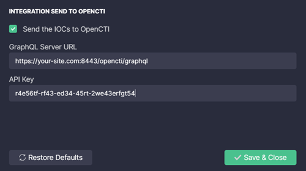

To send a result to OpenCTI:
1. Select the result you want to send and click the **Send to OpenCTI** icon.

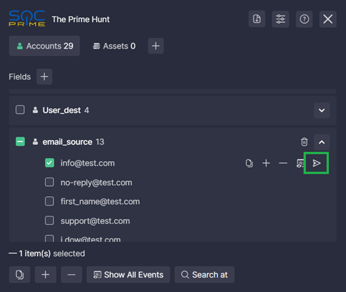

2. Set the IOC parameters:
   - Name: pre-filled with the selected result (required)
   - Main Observable Type: automatically defined but can be changed (required)
   - Pattern: automatically defined but can be edited (required)
   - Indicator Type: select one or multiple options defined in your OpenCTI account
   - Labels: select one or multiple options defined in your OpenCTI account
   - Markings: select one or multiple options defined in your OpenCTI account
3. Optionally, set the following checkboxes:
   - Detection
   - Create observable from indicator

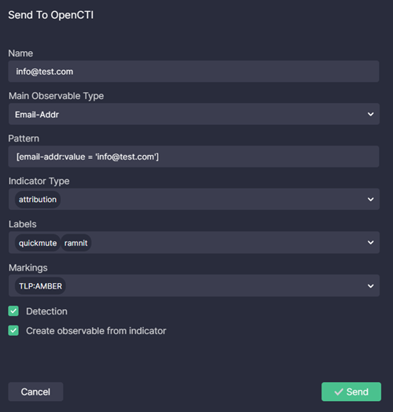

4. Click **Send**.

If the result has been successfully sent, a confirmation message is shown.

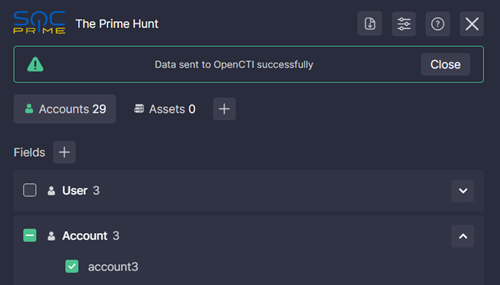


#### Adding Integrations
You can add an integration with any service. To create a new integration:
1. Click **Add New Integration**.
2. Enter the display name that will be shown in the **Search At** menu.
3. Enter the integration URL.
4. Click **Save & Close**.


To delete an integration, click the remove icon next to it.

**NOTE:** The Prime Hunt browser extension does not send any data outside your laptop/browser. It works only with the data that is on the page of your browser.


### Mail Templates
Set up mail templates to automatically compose a new template-based email with selected results in your default email client and share IOCs in a couple of clicks.

You can customize the default template named **Send IOCs** or create a new one.

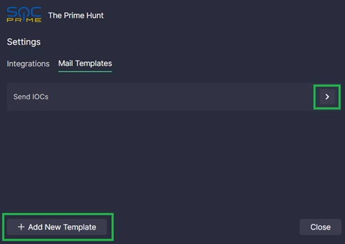

#### Customizing the default template
1. Open the template by clicking the right arrow next to its name
2. Customize the filed values:
   - **Display Name.** The name of the option to send an email based on this template in the extension's UI
   - **Email.** The "to" email address
   - **Subject.** The subject of the email
   - **Message.** The body of the email
      - Modify the text according to your needs
      - Don't forget to include your name, job title, and organization name
      - Keep the `%iocs` parameter as it is. It will be replaced with a list of selected results (IOCs) when composing the email
3. Click **Save & Close**.

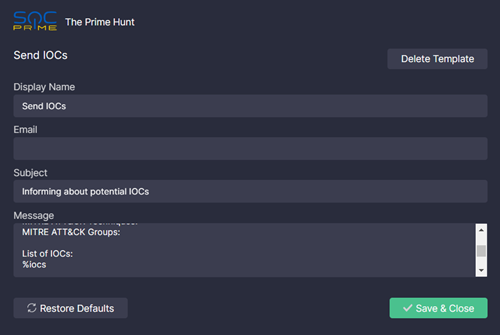

You can also restore defaults and delete the template.

#### Creating a new mail template
1. Click **Add New Template** under **Settings** > **Mail Templates**.
2. Fill the following fields:
   - **Display Name.** The name of the option to send an email based on this template in the extension's UI
   - **Email.** The "to" email address
   - **Subject.** The subject of the email
   - **Message.** The body of the email. Add the `%iocs` parameter in the place where you'd like the iOCs to be listed when composing the email
3. Click **Save & Close**.

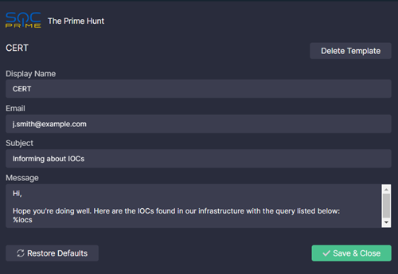

#### Using mail templates
To use a template:
1. Select one or multiple results in the extension.
2. Select a template:
   - To send a single result, click the plane icon next to the result and select a template
   - To send multiple results, click the **Send to** button in the footer of the extension and select a template

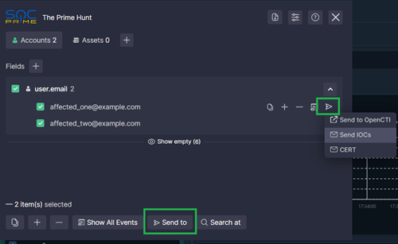

3. Your default mailto handler is opened with the selected template pre-populated with the IOCs. Make any adjustments you may need and send the email.

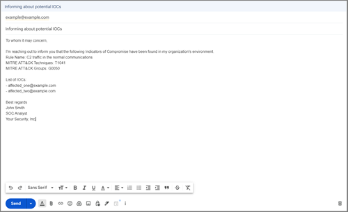

## Hot Keys
- Hide/Show the extension: Ctrl + Q
- Close FAQ: Esc
- Save and close the Integration Settings: Esc
- Apply changes when creating or editing a custom tab: Enter(Return)/Esc

## Credits
This software was created as a work made for hire for SOC Prime, Inc. by the following individuals:
- Pavlo Nedzelskiy
- Alex Bredikhin
- Andrii Bezverkhyi

## License
The Prime Hunt browser extension is licensed as [LGPL v3](LICENSE.md).

## TODO List
1. Add more SIEM/EDR/XDR technologies supported by Sigma.
2. Add more integrations:
- Uncoder.IO, tdm.socprime.com, and SigmaHQ
- Sigma Rules Bot for Threat Bounty (Slackbot) API for Sigma rules quality check, easy code updates, spell check, collaboration, false-positives, and filters sharing
- socprime.com search engine for Sigma rule source, context, and timeline overview
- Qualys, Tenable, NVD for CVE lookup
- GreyNoise, PolySwarm
- Jira, SNOW
